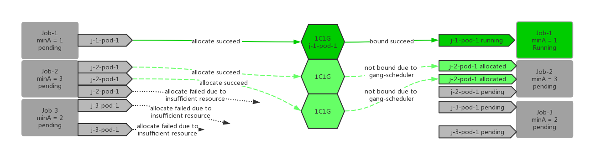
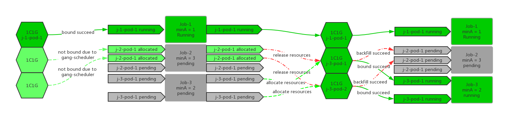
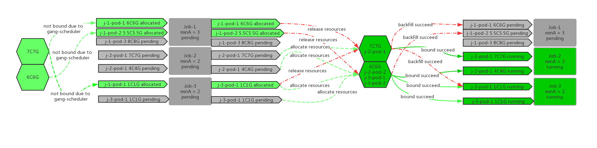
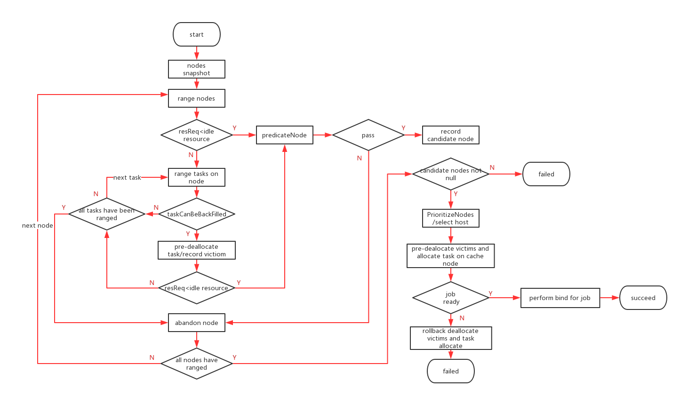

# BackFill Action

## Table of Contents

- [BackFill Action](#backfill-action)
  * [Table of Contents](#table-of-contents)
  * [Introduction](#introduction)
  * [Motivation](#motivation)
  * [Function Detail](#function-detail)
    + [Which jobs can try to backFill other pod's resources](#which-jobs-can-try-to-backfill-other-pod-s-resources)
    + [Which jobs resources may be backFilled by other jobs](#which-jobs-resources-may-be-backfilled-by-other-jobs)
    + [Other constraints between the above two jobs](#other-constraints-between-the-above-two-jobs)
    + [BackFill logic](#backfill-logic)
  * [References](#references)
  
## Introduction

The `backfill` action will do two things. The first thing is to allocate resources for the best effort pods. The second 
thing is to determine if there are any wasted resources in the nodes, and then try to redistribute the remaining resources
in nodes. when a higher-priority pod occupies some resources but not actually use it, the `backfill` action attempts to 
release the resources it occupies and allocate it to pods with a lower priority, provided that the pods with a lower 
priority can be scheduled after obtaining the resources.

## Motivation

The `allocate` action in `kube-batch` will try to allocate resources for the non-BestEffort task. when the number of
assigned tasks meets the job running requirements, the binding operation is performed for the pod. In this process, the 
pods enter the sequence in a certain order, waiting to be taken out by kube-batch and scheduled one by one. The position 
of the pod in the sequence will affect the scheduling result of itself. There are many ways to sort pods, according to 
the priority of pod and the creation time of pod is two important sorting strategies in pod sorting. In general, the 
higher the priority of the pod, or the earlier the pod is created, it will be prioritized to be scheduled. Then this will
cause a waste of resources. In a cluster with a small resource, or in a scenario where a large number of pods are delivered, 
some pods with higher priority or earlier creation time are allocated resources by the `allocate` action, but the job 
to which the pod belongs to does not reach the running condition, so it can not be bound to the node. However, because 
it temporarily uses the only resources on the node, the pod with lower priority, or the pod with later creation time can 
not be assigned resources by the `allocate` action, and thus can not be scheduling. 

In the above scenario, pods who have been allocated resources and not bound to node need to release the resources they 
own. The pods with lower priority or later creation time are attempted to be dispatched to these nodes. If after the 
releasing of pre-order pods, the subsequent pods can be allocated resources normally, and at the same time, allocated pod
number satisfy the job running condition, this is, the pods can be scheduled successfully. Then resources of pre-order pods
who were allocated resources but can not be scheduled successfully are released, and the pods that satisfy the running 
conditions are successfully scheduled. The above process is completed by the `backfill` action.

## Function Detail

### Which jobs can try to backFill other pod's resources

* Only if there is a pending pod in the job, the job needs to backFill resources of other pods

  If the job contains pods in the `pending` status, it means that the job contains pods that need to be scheduled. The 
  `backfill` action will attempt to allocate resources for these pods. 
    
* Regardless of whether the pod under the job is backFilled by other pods, there is `pending` pod under the job, it can 
perform the backFill action

### Which jobs resources may be backFilled by other jobs

* job does not meet the running condition, for example, does not meet the constraints of gang-scheduler
* Only when the status of pod is `allocated`, its resources can be backFilled by other jobs

### Other constraints between the above two jobs

* Job can only backFill resources of jobs in the same queue as it
* When performing the backFill operation, the task under the job can not backFill resource of other tasks under the current job
* During the backFill process, the job does not care about the priority of other jobs. This is, it can backFill jobs that
are higher that its priority, or backFill jobs that are lower that its priority

### BackFill logic

The `selectPotentialVictims` select all candidate nodes and the corresponding victims on these nodes, The nodes satisfied 
the resource requirement of the pod by releasing the resources already allocated to these victims.

When the idle resources of the node meet the pod scheduling requirements, use the `PredicateFn` function to judge whether
the node satisfied the scheduling of the pod.

After selecting all candidate nodes and their corresponding victims, use the `selectHost` to select the most appropriate
node for the pod

If the node has already met the pod scheduling without releasing any resource, then this node will be selected as the node 
that the pod will be scheduled.

Pre-release the victim pods on the victim node and then pre-allocate the pod to the selected node

If the job where the pod is located satisfies the running condition, the binding action is started for the pod under the
job. Otherwise, the victims' resources released in advance are returned to the node, and the victim pods are rebounded to
the node.

## References

* [TaskOrder](https://github.com/kubernetes-sigs/kube-batch/blob/master/doc/design/task-order.md)

